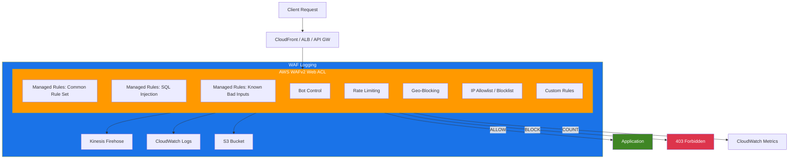

# terraform-aws-waf

Terraform module for creating and managing AWS WAFv2 Web ACLs with managed rules, rate limiting, geoblocking, Bot Control, IP sets, custom rules, and logging.

## Architecture



## Features

- AWS WAFv2 Web ACL with configurable default action (allow/block)
- AWS Managed Rule Groups with override actions and rule exclusions
- AWS Bot Control with COMMON or TARGETED inspection levels
- Rate-based rules with optional scope-down statements
- IP set reference rules (allow/block lists)
- Geo match rules for country-based blocking
- Custom rules (byte match, geo match, size constraint)
- WAF logging to Kinesis Firehose, CloudWatch Logs, or S3
- Automatic CloudWatch Log Group creation when no log destination is specified
- Log field redaction (URI path, query string, headers)
- Web ACL association with ALB, API Gateway, AppSync, and Cognito
- Support for both REGIONAL and CLOUDFRONT scopes

## Usage

### Basic

```hcl
module "waf" {
  source = "github.com/kogunlowo123/terraform-aws-waf"

  name        = "my-web-acl"
  description = "Web ACL with common protections"
  scope       = "REGIONAL"

  managed_rule_groups = [
    {
      name            = "AWSManagedRulesCommonRuleSet"
      priority        = 10
      override_action = "none"
      excluded_rules  = []
    },
    {
      name            = "AWSManagedRulesKnownBadInputsRuleSet"
      priority        = 20
      override_action = "none"
      excluded_rules  = []
    }
  ]

  tags = {
    Environment = "production"
  }
}
```

### With Rate Limiting and Geoblocking

```hcl
module "waf" {
  source = "github.com/kogunlowo123/terraform-aws-waf"

  name           = "advanced-web-acl"
  default_action = "allow"

  managed_rule_groups = [
    {
      name            = "AWSManagedRulesCommonRuleSet"
      priority        = 10
      override_action = "none"
      excluded_rules  = []
    }
  ]

  rate_limit_rules = [
    {
      name     = "global-rate-limit"
      priority = 100
      rate     = 2000
      action   = "block"
    }
  ]

  geo_match_rules = [
    {
      name          = "block-countries"
      country_codes = ["RU", "CN", "KP"]
      action        = "block"
      priority      = 200
    }
  ]

  enable_bot_control = true
}
```

### With IP Sets and Logging

```hcl
module "waf" {
  source = "github.com/kogunlowo123/terraform-aws-waf"

  name = "full-web-acl"

  ip_set_rules = [
    {
      name       = "block-bad-ips"
      ip_set_arn = aws_wafv2_ip_set.blocked.arn
      action     = "block"
      priority   = 5
    }
  ]

  enable_logging       = true
  log_destination_arns = [aws_kinesis_firehose_delivery_stream.waf.arn]

  redacted_fields = [
    {
      type = "single_header"
      name = "authorization"
    }
  ]

  resource_arns = [aws_lb.main.arn]
}
```

## Examples

- [Basic](examples/basic/) - Simple Web ACL with managed rules
- [Advanced](examples/advanced/) - Rate limiting, geoblocking, and IP sets
- [Complete](examples/complete/) - All features including Bot Control, custom rules, and logging

## AWS Managed Rule Groups

The following AWS managed rule groups can be used with the `managed_rule_groups` variable. Use the **Rule Group Name** value in the `name` field.

### Baseline Rule Groups

| Rule Group Name | Description |
|---|---|
| `AWSManagedRulesCommonRuleSet` | Core rule set (CRS) with protection against common threats including OWASP Top 10 |
| `AWSManagedRulesAdminProtectionRuleSet` | Blocks external access to administrative pages |
| `AWSManagedRulesKnownBadInputsRuleSet` | Blocks request patterns known to be malicious (Log4j, etc.) |

### Use-Case Specific Rule Groups

| Rule Group Name | Description |
|---|---|
| `AWSManagedRulesSQLiRuleSet` | Protection against SQL injection attacks |
| `AWSManagedRulesLinuxRuleSet` | Blocks Linux-specific LFI attacks |
| `AWSManagedRulesUnixRuleSet` | Blocks POSIX/POSIX-like OS specific LFI attacks |
| `AWSManagedRulesWindowsRuleSet` | Blocks Windows-specific attacks (PowerShell, etc.) |
| `AWSManagedRulesPHPRuleSet` | Blocks attacks specific to PHP applications |
| `AWSManagedRulesWordPressRuleSet` | Blocks attacks specific to WordPress sites |

### IP Reputation Rule Groups

| Rule Group Name | Description |
|---|---|
| `AWSManagedRulesAmazonIpReputationList` | Blocks IPs associated with bots or threats based on Amazon internal threat intelligence |
| `AWSManagedRulesAnonymousIpList` | Blocks requests from services that allow identity obfuscation (VPNs, proxies, Tor, hosting providers) |

### Bot Control Rule Groups

| Rule Group Name | Description |
|---|---|
| `AWSManagedRulesBotControlRuleSet` | Managed bot protection with COMMON and TARGETED inspection levels. Enable via `enable_bot_control` variable. |

### ATP (Account Takeover Prevention)

| Rule Group Name | Description |
|---|---|
| `AWSManagedRulesATPRuleSet` | Detects and blocks account takeover attempts with stolen credentials |

### ACFP (Account Creation Fraud Prevention)

| Rule Group Name | Description |
|---|---|
| `AWSManagedRulesACFPRuleSet` | Detects and blocks fraudulent account creation attempts |

## Requirements

| Name | Version |
|---|---|
| terraform | >= 1.0 |
| aws | >= 4.0 |

## Providers

| Name | Version |
|---|---|
| aws | >= 4.0 |

## Resources

| Name | Type |
|---|---|
| [aws_wafv2_web_acl.this](https://registry.terraform.io/providers/hashicorp/aws/latest/docs/resources/wafv2_web_acl) | resource |
| [aws_cloudwatch_log_group.waf](https://registry.terraform.io/providers/hashicorp/aws/latest/docs/resources/cloudwatch_log_group) | resource |
| [aws_wafv2_web_acl_logging_configuration.this](https://registry.terraform.io/providers/hashicorp/aws/latest/docs/resources/wafv2_web_acl_logging_configuration) | resource |
| [aws_wafv2_web_acl_association.this](https://registry.terraform.io/providers/hashicorp/aws/latest/docs/resources/wafv2_web_acl_association) | resource |
| [aws_caller_identity.current](https://registry.terraform.io/providers/hashicorp/aws/latest/docs/data-sources/caller_identity) | data source |
| [aws_region.current](https://registry.terraform.io/providers/hashicorp/aws/latest/docs/data-sources/region) | data source |

## Inputs

| Name | Description | Type | Default | Required |
|---|---|---|---|---|
| name | The name of the WAFv2 Web ACL | `string` | n/a | yes |
| scope | Scope of the WAF (REGIONAL or CLOUDFRONT) | `string` | `"REGIONAL"` | no |
| description | A friendly description of the Web ACL | `string` | `""` | no |
| default_action | The default action (allow or block) | `string` | `"allow"` | no |
| managed_rule_groups | List of AWS managed rule groups | `list(object)` | `[]` | no |
| rate_limit_rules | List of rate-based rules | `list(object)` | `[]` | no |
| ip_set_rules | List of IP set reference rules | `list(object)` | `[]` | no |
| geo_match_rules | List of geo match (geoblocking) rules | `list(object)` | `[]` | no |
| custom_rules | List of custom rules | `list(object)` | `[]` | no |
| enable_logging | Whether to enable WAF logging | `bool` | `true` | no |
| log_destination_arns | List of logging destination ARNs | `list(string)` | `[]` | no |
| redacted_fields | List of fields to redact from logs | `list(object)` | `[]` | no |
| resource_arns | List of resource ARNs to associate with the Web ACL | `list(string)` | `[]` | no |
| enable_bot_control | Whether to enable AWS Bot Control | `bool` | `false` | no |
| bot_control_priority | Priority for the Bot Control rule group | `number` | `50` | no |
| bot_control_inspection_level | Bot Control inspection level (COMMON or TARGETED) | `string` | `"COMMON"` | no |
| tags | A map of tags to add to all resources | `map(string)` | `{}` | no |

## Outputs

| Name | Description |
|---|---|
| web_acl_id | The ID of the WAFv2 Web ACL |
| web_acl_arn | The ARN of the WAFv2 Web ACL |
| web_acl_name | The name of the WAFv2 Web ACL |
| web_acl_capacity | The capacity units used by the Web ACL |
| web_acl_visibility_config | The visibility configuration of the Web ACL |
| logging_configuration_id | The ID of the WAF logging configuration |
| cloudwatch_log_group_arn | The ARN of the CloudWatch Log Group (if auto-created) |
| cloudwatch_log_group_name | The name of the CloudWatch Log Group (if auto-created) |
| web_acl_association_ids | Map of resource ARNs to their WAF association IDs |

## License

MIT Licensed. See [LICENSE](LICENSE) for full details.
